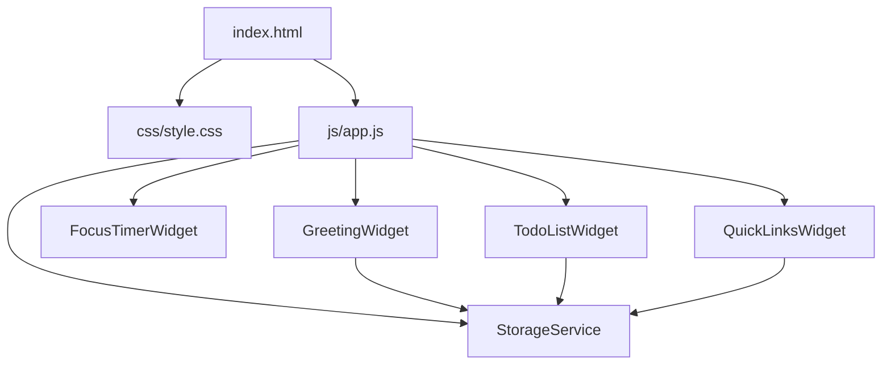

# Design Document: Todo List Dashboard

## Overview

The Todo List Dashboard is a standalone, client-side productivity web application with zero dependencies. It runs entirely in the browser via the `file://` protocol and requires no build tools, package managers, or backend. All four productivity widgets — Greeting, Focus Timer, To-Do List, and Quick Links — are composed on a single HTML page, styled with one external CSS file, and powered by one external JavaScript file. All user data is persisted in the browser's `localStorage` API under namespaced keys.

The design philosophy is simplicity: the entire application is a directory you can open by double-clicking `index.html`. There is no bundling, no transpilation, and no CDN calls.

---

## Architecture

The application follows a **widget-based single-page architecture**. Each widget is a self-contained logical unit with its own render, event-binding, and persistence responsibilities. A thin shared layer handles localStorage I/O and date utilities.



### Module Structure (within `js/app.js`)

Since the project uses a single JS file with no module bundler, the code is organised using the **Revealing Module Pattern** (IIFE-based namespace). Each widget is an immediately-invoked object factory attached to a top-level `App` namespace.

```
App
├── StorageService      — localStorage read/write/delete with error handling
├── DateUtils           — date/time formatting helpers
├── GreetingWidget      — clock, date, and contextual greeting
├── FocusTimerWidget    — countdown timer with Start/Stop/Reset
├── TodoListWidget      — task CRUD + persistence
└── QuickLinksWidget    — link management + persistence
```

The single entry point (`DOMContentLoaded`) calls each widget's `init()` method in order.

---

## Components and Interfaces

### StorageService

Centralises all `localStorage` access. Every read is wrapped in a `try/catch` around `JSON.parse`; every write is wrapped in a `try/catch` around `JSON.stringify` + `localStorage.setItem`.

```
StorageService.load(key)       → Array | null
StorageService.save(key, data) → void   (throws StorageError on QuotaExceededError)
StorageService.remove(key)     → void
```

On `JSON.parse` error:
1. Log error to `console.error`.
2. Call `StorageService.remove(key)`.
3. Return `null` (callers initialise with empty state).

On `localStorage.setItem` `QuotaExceededError`:
1. Log error to `console.error`.
2. Dispatch a custom `storage:quota-exceeded` DOM event containing the widget name.
3. Each widget listens for this event and renders an inline error message.

### DateUtils

Pure functions — no side effects, no DOM access.

```
DateUtils.formatTime(date)     → "HH:MM"   (24-hour)
DateUtils.formatDate(date)     → "Weekday, D Month YYYY"
DateUtils.getTimeOfDay(date)   → "Morning" | "Afternoon" | "Evening"
DateUtils.isValidDate(date)    → boolean
```

### GreetingWidget

```
GreetingWidget.init()   — renders initial state, starts 60-second tick interval
GreetingWidget.render() — reads current Date, updates DOM
```

State: no persistent state. Reads `new Date()` on each tick.

### FocusTimerWidget

```
FocusTimerWidget.init()    — renders initial 25:00 state, binds button events
FocusTimerWidget.start()   — creates setInterval, updates button states
FocusTimerWidget.stop()    — clears interval, retains remaining time
FocusTimerWidget.reset()   — clears interval, restores 25:00, resets buttons
FocusTimerWidget.tick()    — decrements remaining seconds, calls render, checks for completion
FocusTimerWidget.render()  — updates MM:SS display and button enabled/disabled states
```

State (in-memory only, not persisted):
```
{ remaining: number, running: boolean, intervalId: number | null }
```

### TodoListWidget

```
TodoListWidget.init()            — loads from storage, renders, binds events
TodoListWidget.addTask(title)    — creates Task, persists, renders
TodoListWidget.editTask(id, title) — updates Task, persists, renders
TodoListWidget.toggleTask(id)    — flips completion, persists, renders
TodoListWidget.deleteTask(id)    — removes Task, persists, renders
TodoListWidget.renderList()      — full DOM re-render of task list
TodoListWidget.persist()         — calls StorageService.save with current task array
```

### QuickLinksWidget

```
QuickLinksWidget.init()           — loads from storage, renders, binds events
QuickLinksWidget.addLink(label, url) — validates, creates Link, persists, renders
QuickLinksWidget.deleteLink(id)   — removes Link, persists, renders
QuickLinksWidget.renderLinks()    — full DOM re-render of link buttons
QuickLinksWidget.persist()        — calls StorageService.save with current link array
```

---

## Data Models

### Task

```javascript
{
  id:        string,   // crypto.randomUUID() or Date.now().toString() fallback
  title:     string,   // trimmed, non-empty
  completed: boolean   // false on creation
}
```

Persisted under key: `"todo-list-dashboard:tasks"` as a JSON array.

### Link

```javascript
{
  id:    string,   // crypto.randomUUID() or Date.now().toString() fallback
  label: string,   // 1–100 characters, trimmed
  url:   string    // 1–2048 characters, must start with "http://" or "https://"
}
```

Persisted under key: `"todo-list-dashboard:links"` as a JSON array.

### Validation Rules

| Field        | Rule                                              |
|--------------|---------------------------------------------------|
| Task.title   | After trim: length ≥ 1                            |
| Link.label   | After trim: length ≥ 1, ≤ 100 characters          |
| Link.url     | After trim: starts with `http://` or `https://`, length ≤ 2048 |
| Links count  | Maximum 50 entries                                |

### LocalStorage Schema

```
localStorage["todo-list-dashboard:tasks"]  → JSON string of Task[]
localStorage["todo-list-dashboard:links"]  → JSON string of Link[]
```

---

## Correctness Properties

*A property is a characteristic or behavior that should hold true across all valid executions of a system — essentially, a formal statement about what the system should do. Properties serve as the bridge between human-readable specifications and machine-verifiable correctness guarantees.*

### Property 1: Task persistence round-trip

*For any* array of valid Task objects saved via `StorageService.save("todo-list-dashboard:tasks", tasks)`, reading back the stored value via `StorageService.load("todo-list-dashboard:tasks")` must return an array that is deeply equal to the original array.

**Validates: Requirements 4.10, 4.11, 6.1, 6.3, 6.4**

---

### Property 2: Link persistence round-trip

*For any* array of valid Link objects saved via `StorageService.save("todo-list-dashboard:links", links)`, reading back the stored value via `StorageService.load("todo-list-dashboard:links")` must return an array that is deeply equal to the original array.

**Validates: Requirements 5.7, 5.8, 6.2, 6.3, 6.4**

---

### Property 3: Task whitespace-title rejection

*For any* string composed entirely of whitespace characters (including the empty string), calling `TodoListWidget.addTask(input)` must leave the task list unchanged and must not create a new Task.

**Validates: Requirements 4.3**

---

### Property 4: Task edit whitespace rejection

*For any* existing Task and any string composed entirely of whitespace characters, calling `TodoListWidget.editTask(id, input)` must leave the Task's title unchanged.

**Validates: Requirements 4.6**

---

### Property 5: Task completion toggle is its own inverse

*For any* Task, toggling its completion status twice must return the Task to its original completion state (i.e., `toggle(toggle(task)).completed === task.completed`).

**Validates: Requirements 4.8**

---

### Property 6: Link URL protocol validation

*For any* string that does not begin with `"http://"` or `"https://"` (after trimming), calling `QuickLinksWidget.addLink(label, url)` must not create a new Link entry.

**Validates: Requirements 5.4**

---

### Property 7: Link whitespace field rejection

*For any* pair of strings where the label or the URL (or both) consist entirely of whitespace characters, calling `QuickLinksWidget.addLink(label, url)` must not create a new Link and must leave the link list unchanged.

**Validates: Requirements 5.3**

---

### Property 8: Link count cap enforcement

*For any* link list already containing 50 entries, calling `QuickLinksWidget.addLink(label, url)` with a valid label and URL must not increase the list size beyond 50.

**Validates: Requirements 5.11**

---

### Property 9: Greeting time-of-day mapping is exhaustive and disjoint

*For any* valid `Date` value, `DateUtils.getTimeOfDay(date)` must return exactly one of `"Morning"`, `"Afternoon"`, or `"Evening"`, and the result must be consistent with the hour boundaries (05–11 → Morning, 12–17 → Afternoon, 18–23 and 00–04 → Evening).

**Validates: Requirements 2.3, 2.4, 2.5**

---

### Property 10: Corrupted localStorage yields empty state

*For any* string value stored under `"todo-list-dashboard:tasks"` or `"todo-list-dashboard:links"` that is not parseable as a valid JSON array of the expected shape, `StorageService.load(key)` must return `null`, and the affected widget must initialise with an empty list.

**Validates: Requirements 4.13, 5.10, 6.5**

---

### Property 11: Focus Timer decrement preserves bounds

*For any* running FocusTimer state with `remaining > 0`, each `tick()` call must decrement `remaining` by exactly 1 and must never result in a `remaining` value below 0.

**Validates: Requirements 3.3, 3.7**

---

### Property 12: Focus Timer reset is idempotent from any state

*For any* FocusTimer state (running or stopped, any remaining value), calling `reset()` must always yield a state of `{ remaining: 1500, running: false, intervalId: null }`.

**Validates: Requirements 3.6, 3.11**

---

## Error Handling

### localStorage Errors

| Error Condition | Handling |
|---|---|
| `JSON.parse` failure on load | Log to console, remove key, initialise widget with empty state |
| `QuotaExceededError` on save | Log to console, dispatch `storage:quota-exceeded` event, widget shows inline error |
| `localStorage` unavailable (e.g., private browsing restrictions) | `StorageService.load` returns `null`; `StorageService.save` swallows the error and dispatches the event |

### Input Validation Errors

All validation errors are displayed as **inline messages** adjacent to the relevant input field. They are:
- Rendered as `<span role="alert">` elements so screen readers announce them.
- Cleared automatically when the user next modifies the input field.

| Scenario | Message |
|---|---|
| Empty/whitespace task title on add | "Please enter a task title." |
| Empty/whitespace task title on edit confirm | "Task title cannot be empty." |
| Empty link label | "Please enter a label for this link." |
| Empty link URL | "Please enter a URL for this link." |
| Invalid URL protocol | "URL must start with http:// or https://" |
| Maximum links reached | "Maximum of 50 links reached." |

### Timer Errors

- Duplicate `start()` calls are ignored (guarded by the `running` flag).
- `setInterval` is always cleared before creating a new one to prevent interval stacking.

### Date API Errors

- `DateUtils.isValidDate()` guards all `Date` usage.
- On invalid date: time and date displays show `"--:--"` / `"Date unavailable"`, greeting is omitted.

---

## Testing Strategy

### Unit Tests

Unit tests target pure functions and widget logic in isolation, using example-based assertions.

**`DateUtils`**
- `formatTime` returns correct `HH:MM` for midnight, noon, and boundary hours.
- `formatDate` returns the correct weekday, day, month, and year for known dates.
- `getTimeOfDay` returns correct string for each of the three boundary hours (05:00, 12:00, 18:00, 04:59).
- `isValidDate` returns `false` for `new Date("invalid")` and `true` for valid dates.

**`StorageService`**
- Returns `null` and removes key on corrupted JSON input.
- Dispatches `storage:quota-exceeded` event on simulated `QuotaExceededError`.

**`TodoListWidget`**
- Adding a valid task clears the input field.
- Cancelling an edit preserves the original title.
- Deleting a task removes it from the rendered list.

**`QuickLinksWidget`**
- A valid `http://` URL is accepted.
- A valid `https://` URL is accepted.
- A link button opens the URL in a new tab (`target="_blank"`, `rel="noopener noreferrer"`).

### Property-Based Tests

Property-based tests use **fast-check** (a JavaScript PBT library) to verify universal properties across wide input spaces. Each test runs a minimum of **100 iterations**.

Each test is tagged with a comment referencing its design property:
> `// Feature: todo-list-dashboard, Property N: <property_text>`

| Property | Test Description |
|---|---|
| P1 — Task round-trip | `fc.array(arbitraryTask)` → save → load → deep equal |
| P2 — Link round-trip | `fc.array(arbitraryLink)` → save → load → deep equal |
| P3 — Task whitespace rejection | `fc.string().filter(isAllWhitespace)` → addTask → list unchanged |
| P4 — Task edit whitespace rejection | `arbitraryTask, fc.string().filter(isAllWhitespace)` → editTask → title unchanged |
| P5 — Toggle double inverse | `arbitraryTask` → toggle → toggle → completion equals original |
| P6 — URL protocol rejection | `fc.string().filter(s => !s.startsWith('http'))` → addLink → list unchanged |
| P7 — Link whitespace rejection | `fc.string().filter(isAllWhitespace)` for label or URL → addLink → list unchanged |
| P8 — Link count cap | seed list of 50 + valid new link → addLink → size still 50 |
| P9 — Greeting exhaustive | `fc.integer({min:0,max:23})` → getTimeOfDay → exactly one of three strings |
| P10 — Corrupted storage | `fc.string().filter(s => !isValidJSON(s))` → load → returns null |
| P11 — Timer decrement bounds | `fc.integer({min:1,max:1500})` → tick() → remaining decremented by 1, never < 0 |
| P12 — Timer reset idempotent | `arbitraryTimerState` → reset() → always `{remaining:1500, running:false}` |

### Integration / Smoke Tests

These are example-based tests executed in a real browser environment (or jsdom) to verify widget wiring:

- Opening `index.html` renders all four widget containers.
- On page load, tasks saved in `localStorage` are rendered correctly.
- On page load, links saved in `localStorage` are rendered correctly.
- The Focus Timer Start button is enabled and Stop is disabled on initial load.
- Clicking the Start button transitions the timer to running state within 200ms.

### Accessibility

- All interactive controls (`<button>`, `<input>`) have accessible labels (either visible text, `aria-label`, or `aria-labelledby`).
- Inline validation messages use `role="alert"` so they are announced by screen readers.
- Tab order follows the visual reading order.
- WCAG 2.1 AA contrast (4.5:1) is verified manually using a contrast checker tool (e.g., browser DevTools accessibility panel or WebAIM Contrast Checker) during visual review.
